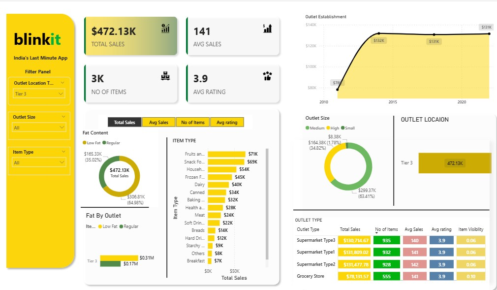

# Spotify Data Analysis Dashboard

## Overview
This project analyzes Spotify listening behavior using a dataset containing detailed playback information such as tracks, artists, albums, platforms, and playback reasons.  
The interactive dashboard visualizes insights about user engagement, platform usage, and listening trends.

---

## Objectives
- Analyze user listening patterns over time.  
- Identify the most played tracks, artists, and albums.  
- Understand user interaction through shuffle mode, skips, and playback reasons.  
- Compare year-over-year listening trends.  
- Visualize engagement across platforms such as Android, iOS, and Web Player.

---

## Data Dictionary

| Field | Description | Example / Format | Purpose |
|-------|--------------|------------------|----------|
| **spotify_track_uri** | Unique Spotify track identifier | `spotify:track:3n3Ppam7vgaVa1iaRUc9Lp` | Maps each play to its metadata |
| **ts** | UTC timestamp when the track stopped playing | `2024-02-07T14:30:45Z` | Used for time-based analysis |
| **platform** | Device/platform used for playback | `desktop`, `mobile`, `web`, `smart_speaker` | Identifies where users listen |
| **ms_played** | Duration played in milliseconds | `215000` | Measures engagement and completion |
| **track_name** | Title of the song | `Shape of You` | Identifies most played tracks |
| **artist_name** | Artist performing the song | `Ed Sheeran` | Ranks artists by preference |
| **album_name** | Album the track belongs to | `÷ (Divide)` | Evaluates album popularity |
| **reason_start** | Reason why the track started | `trackdone`, `clickrow`, `autoplay` | Helps understand playback behavior |
| **reason_end** | Reason why the track stopped | `trackdone`, `fwdbtn`, `logout` | Identifies user drop-off reasons |
| **shuffle** | Whether shuffle mode was enabled | `TRUE` / `FALSE` | Measures random listening habits |
| **skipped** | Whether the track was skipped | `TRUE` / `FALSE` | Tracks user engagement and skips |

---

## Key Insights
- Total albums played: 7,383 (up 20.19% year-over-year)  
- Total artists played: 3,835 (down 24.43% year-over-year)  
- Total tracks played: 12,724 (up 10.42% year-over-year)  
- Top albums: The Beatles, Past Masters, Abbey Road, The Wall, Revolver  
- Top tracks: Ode to Thee, In the Blood, Dying Breed, 19 Days & 500 Nights, For What It’s Worth  

---

## Dashboard Features
- Built using Power BI or Tableau  
- Interactive filters for Platform, Shuffle Mode, and Skipped Tracks  
- KPI cards comparing current vs previous year  
- Trend lines showing listening growth  
- Visuals comparing weekday vs weekend engagement  

---

## Tools and Technologies
- Python and Pandas for data cleaning and preprocessing  
- Power BI or Tableau for data visualization  
- Excel or CSV for data transformation  
- Spotify API (optional) for metadata enrichment  

---

📸 **Preview:**  

### Uber Trip Analysis
An analytical dashboard focused on Uber trips in Brooklyn (June 2024). Key metrics: total bookings, trip distance, avg. trip time, and vehicle usage.

➡️ **Tools:** Power BI, Excel  
📸 

👉 [Click here to see the complete project](https://github.com/lalithasaipasala/city-accident-analysis-excel/blob/main/Uber%20Analysis-20250519T142154Z-1-001.zip)

---

### Amazon Product Sales
Highlights YTD and QTD sales, best-selling products, and category performance using Amazon dataset.

➡️ **Tools:** Power BI  
📸 

👉 [Click here to see the complete project](https://github.com/lalithasaipasala/city-accident-analysis-excel/blob/main/Amazon%20Sales-20250519T141943Z-1-001.zip)

---
## 💵 4. Financial Complaints Overview

Visualizes 75,000+ financial complaints across different categories:
- Timely Response Rates & Dispute Rate
- Complaint Issues by Type
- Monthly Trends and Product-wise breakdown

🔧 **Tools:** Power BI, Public Complaint Data  
📸 **Preview:**  

👉 [Click here to see the complete project]()

## 🏥 Healthcare Screening Analysis

A healthcare-focused dashboard displaying:
- Member Screening Eligibility & Status (Received vs. Not Received)
- Breakdown by Race, Language, Ethnicity & Region
- Interactive filtering capabilities

🔧 **Tools:** Power BI, Health Screening Dataset  
📸 **Preview:**  

👉 [Click here to see the complete project](https://github.com/lalithasaipasala/city-accident-analysis-excel/blob/main/Healthcare%20Report.pbix)

# blinkit-dashboard

# 📦 Blinkit Sales Dashboard

Click HERE:

This project analyzes Blinkit’s sales data using Power BI. It highlights KPIs like total revenue, category performance, and trends.
## 📸 Dashboard Preview

👉 [Click here to see the complete project](https://github.com/yourusername/uber-trip-dashboard)

****
---

### Indian Elections 2024 - Fatehpur
Shows the result summary of the Fatehpur constituency with party-wise vote stats, EVM/postal breakdown, and vote share percentage.

➡️ **Tools:** Power BI  
📸 

👉 [Click here to see the complete project](https://github.com/lalithasaipasala/city-accident-analysis-excel/blob/main/India%20Elections%20Results%20Analysis_PowerBI-20250519T142127Z-1-001.zip)

